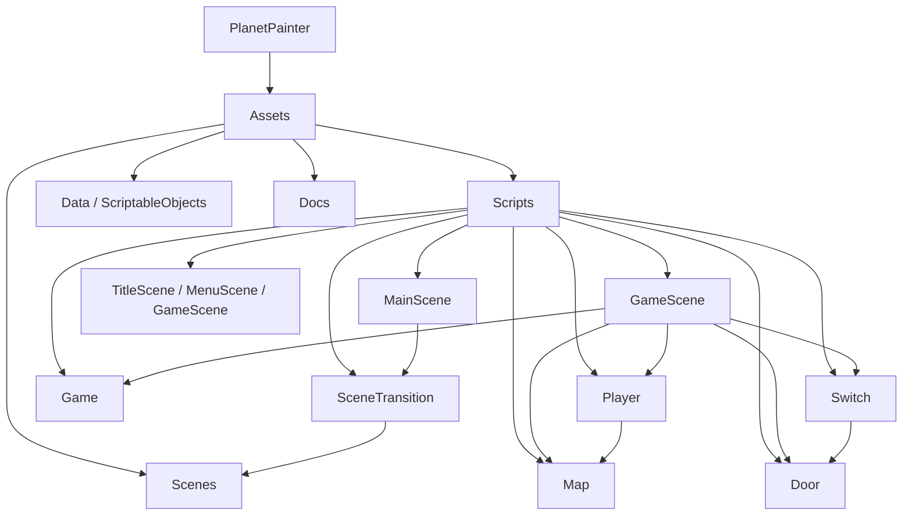

# PlanetPainter — Codex Repository Guide

> Last refreshed: 2026-09-11

PlanetPainter is a Unity 6 (URP) 2D/isometric color-painting puzzle game. The player navigates eight levels, changes color through interactables, paints tilemaps, opens matching doors, and returns through Title → Menu → Game scene flow. The project targets Android/tablet play; the current package manifest also includes WebGL-capable Unity modules.

## Architecture overview

The runtime is split into Unity assembly-definition modules under `Assets/Scripts`. `MainScene` creates the cross-scene Zenject container and `SceneTransition` loads addressable scenes. `GameScene/GameInstaller` composes gameplay services (Player, Map, Door, Switch, Camera, Game) and declares signals. Services expose small interfaces; handlers own state, movement, collision, animation, and presentation updates. ScriptableObjects under `Assets/Data` and module `ScriptableObject/` folders provide level and scene configuration.

## Module index

| Module | Responsibility | Entry / important paths |
|---|---|---|
| [Audio](Assets/Scripts/Audio/AGENTS.md) | BGM/SFX service and view | `AudioService.cs`, `IAudioService.cs` |
| [Data](Assets/Scripts/Data/AGENTS.md) | Runtime game data and ScriptableObjects | `GameData.cs`, `ScriptableObject/` |
| [Door](Assets/Scripts/Door/AGENTS.md) | Pooled, color-locked doors | `DoorSpawner.cs`, `DoorView.cs` |
| [Game](Assets/Scripts/Game/AGENTS.md) | Gameplay state machine and level bootstrap | `GameService.cs`, `Handler/` |
| [GameScene](Assets/Scripts/GameScene/AGENTS.md) | Gameplay installer, HUD, D-pad, result/pause UI | `GameInstaller.cs`, `UI/` |
| [Interactable](Assets/Scripts/Interactable/AGENTS.md) | Shared interaction base class | `BaseInteractableView.cs` |
| [IntroScene](Assets/Scripts/IntroScene/AGENTS.md) | Intro video flow | `UI/UI_Intro.cs` |
| [MainCamera](Assets/Scripts/MainCamera/AGENTS.md) | Player-follow camera | `CameraService.cs`, `CameraView.cs` |
| [MainScene](Assets/Scripts/MainScene/AGENTS.md) | Bootstrap and root DI container | `Bootstrap.cs`, `MainInstaller.cs` |
| [Map](Assets/Scripts/Map/AGENTS.md) | Tile painting and percentage tracking | `MapService.cs`, `Handler/` |
| [Menu](Assets/Scripts/Menu/AGENTS.md) | Menu state machine | `MenuService.cs`, `MenuEvent.cs` |
| [MenuScene](Assets/Scripts/MenuScene/AGENTS.md) | Level select and storyboard UI | `MenuInstaller.cs`, `UI/` |
| [Misc](Assets/Scripts/Misc/AGENTS.md) | Shared UI animation and debug settings | `UI_SetAppear.cs`, `ScriptableObject/` |
| [Notify](Assets/Scripts/Notify/AGENTS.md) | Notification popup service | `NotifyService.cs`, `NotifyView.cs` |
| [Player](Assets/Scripts/Player/AGENTS.md) | Movement, color, collision, animation | `PlayerService.cs`, `Handler/` |
| [SceneTransition](Assets/Scripts/SceneTransition/AGENTS.md) | Addressable scene loading and fades | `SceneService.cs`, `Handler/` |
| [Switch](Assets/Scripts/Switch/AGENTS.md) | Pooled color-changing switches | `SwitchSpawner.cs`, `SwitchView.cs` |
| [Title](Assets/Scripts/Title/AGENTS.md) | Title state machine | `TitleService.cs`, `TitleEvent.cs` |
| [TitleScene](Assets/Scripts/TitleScene/AGENTS.md) | Title/settings/credits/quit UI | `TitleInstaller.cs`, `UI/` |

## Runtime flow and conventions

- Scene flow: `Main` bootstrap → `Title` → `Menu` → `Game`; result/pause actions return to `Menu`, `Game`, or `Title`. `Intro` can precede the title flow.
- DI: use Extenject/Zenject installers and interface bindings. Cross-scene services are registered in `MainInstaller`; level-scoped services are composed by `GameInstaller` and prefab installers.
- Events: use Zenject `SignalBus` (`OnGameStateChanged`, `OnPlayerStateChanged`, `OnPlayerColorChanged`, `OnSwitchColorChanged`, `OnMenuStateChanged`, `OnTitleStateChanged`) for cross-module communication.
- Data: keep authored values in ScriptableObjects; avoid hard-coding level content in services.
- Naming: PascalCase types/methods, `_camelCase` private fields, `UI_` prefix for UI MonoBehaviours, and `Type/` for enums.

## Tooling and development

- Open with Unity `6000.6.0f1` (from `ProjectSettings/ProjectVersion.txt`).
- Dependencies are declared in `Packages/manifest.json`: Extenject 9.2.0, UniTask 2.5.10, UniRx 7.1.0, Addressables 2.11.2, Input System 1.20.0, URP 17.6.0, DOTween, and Unity Test Framework.
- Main scenes live in `Assets/Scenes/{Main,Intro,Title,Menu,Game}.unity`.
- Build configuration is stored in `ProjectSettings/`; WebGL template assets are under `Assets/WebGLTemplates/PlanetPainter/`.

## Testing and quality

No dedicated C# test fixtures were found during this scan. Validate changes in Unity by opening the relevant scene, entering Play Mode, exercising scene transitions and signal-driven UI, and checking Android/WebGL builds as applicable. Keep each assembly definition compiling independently.

## AI usage guidance

Read the nearest module `AGENTS.md` before editing that module, then inspect its `.asmdef`, installer, service interface, handlers, and tests (if added). Preserve signal contracts and pooled entity lifecycles. Do not edit generated Unity `Library/`, `Temp/`, build output, or `.meta` files unless the task explicitly requires it.

## Scan coverage and gaps

The 2026-09-11 architecture scan indexed 13,382 tracked files, including 101 C# source files and all 19 script modules. Documentation coverage is complete for the discovered module directories via these `AGENTS.md` files. There are no test directories/fixtures in the scanned source tree; this is the main quality gap. Generated Unity directories and binary/media assets were skipped according to `.gitignore` plus the default binary ignore set. See `.codex/index.json` for the machine-readable checkpoint and recommended follow-up paths.

## Changelog

- 2026-09-11: Added Codex-facing root architecture guide, module index, Mermaid dependency map, and scan guidance.
