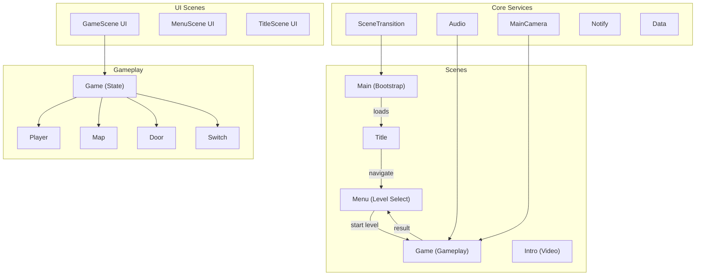
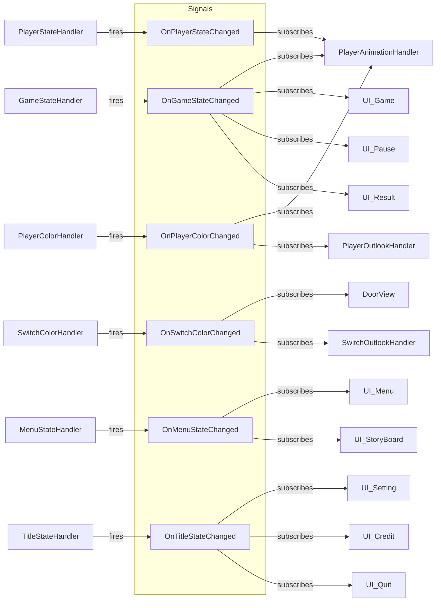

# PlanetPainter

> Last updated: 2026-03-17

A 2D top-down tile-painting puzzle game built with Unity 6 (URP). Players navigate levels, absorb colors from switches, and paint tiles to unlock doors and complete stages. Targets WebGL (itch.io) with 16:10 letterboxing.

## Architecture Overview

## Tech Stack

| Component | Technology |
|-----------|-----------|
| Engine | Unity 6000.0.42f1 (URP 17.3.0) |
| DI Framework | Zenject (Extenject 9.2.0) |
| Async | UniTask 2.5.10 |
| Reactive | UniRx 7.1.0 |
| Asset Loading | Addressables 2.9.0 |
| Input | Unity Input System 1.18.0 |
| Build Target | WebGL (custom template with 16:10 letterbox) |

## Key Patterns

- **Service / Repository** — each system exposes an interface (`IXxxService`) with a concrete service and data repository
- **Handler Pattern** — services delegate to focused handlers (state, animation, collision, color, movement)
- **Facade + Pool** — `DoorFacade` / `SwitchFacade` use Zenject memory pools for entity lifecycle
- **Signal Bus** — Zenject signals for decoupled cross-module events
- **View / Model Separation** — MonoBehaviour views handle rendering; services handle logic

## Signal Bus Flow

## DI Container (MainInstaller — cross-scene singletons)

| Binding | Interface | Scope |
|---------|-----------|-------|
| `AudioService` | `IAudioService` | AsSingle |
| `SceneService` | `ISceneService` | AsSingle |
| `NotifyService` | `INotifyService` | AsSingle |
| `GameData` | — | AsSingle |
| `SceneLoadHandler` | — | AsSingle |
| `SceneStateHandler` | — | AsSingle |
| `LevelSettings` | — | BindInstance |
| `PlayerSettings` | — | BindInstance |
| `DoorSettings` | — | BindInstance |
| `SwitchSettings` | — | BindInstance |

## Scene Flow

`Main (Bootstrap)` → `Title` → `Menu (Level Select)` → `Game` → `Result` → `Menu`

Optional: `Intro` plays before `Title` on first launch.

## Module Index

| Module | Path | Purpose |
|--------|------|---------|
| [Audio](Assets/Scripts/Audio/CLAUDE.md) | `Scripts/Audio/` | BGM and SFX playback |
| [Data](Assets/Scripts/Data/CLAUDE.md) | `Scripts/Data/` | Game configuration and persistence |
| [Door](Assets/Scripts/Door/CLAUDE.md) | `Scripts/Door/` | Colored doors blocking progress |
| [Game](Assets/Scripts/Game/CLAUDE.md) | `Scripts/Game/` | Game state machine |
| [GameScene](Assets/Scripts/GameScene/CLAUDE.md) | `Scripts/GameScene/` | Game HUD, D-pad, pause/result UI |
| [Interactable](Assets/Scripts/Interactable/CLAUDE.md) | `Scripts/Interactable/` | Base class for interactive objects |
| [IntroScene](Assets/Scripts/IntroScene/CLAUDE.md) | `Scripts/IntroScene/` | Intro video splash |
| [MainCamera](Assets/Scripts/MainCamera/CLAUDE.md) | `Scripts/MainCamera/` | Camera follow service |
| [MainScene](Assets/Scripts/MainScene/CLAUDE.md) | `Scripts/MainScene/` | Bootstrap and root DI installer |
| [Map](Assets/Scripts/Map/CLAUDE.md) | `Scripts/Map/` | Tilemap painting and percentage |
| [Menu](Assets/Scripts/Menu/CLAUDE.md) | `Scripts/Menu/` | Menu state management |
| [MenuScene](Assets/Scripts/MenuScene/CLAUDE.md) | `Scripts/MenuScene/` | Level selection and storyboard UI |
| [Misc](Assets/Scripts/Misc/CLAUDE.md) | `Scripts/Misc/` | Shared utilities and base classes |
| [Notify](Assets/Scripts/Notify/CLAUDE.md) | `Scripts/Notify/` | Notification popups |
| [Player](Assets/Scripts/Player/CLAUDE.md) | `Scripts/Player/` | Player movement, color, animation |
| [SceneTransition](Assets/Scripts/SceneTransition/CLAUDE.md) | `Scripts/SceneTransition/` | Addressable scene loading with fade |
| [Switch](Assets/Scripts/Switch/CLAUDE.md) | `Scripts/Switch/` | Color-changing switches |
| [Title](Assets/Scripts/Title/CLAUDE.md) | `Scripts/Title/` | Title screen state management |
| [TitleScene](Assets/Scripts/TitleScene/CLAUDE.md) | `Scripts/TitleScene/` | Title/settings/credits UI |

## Assembly Definitions

Each module has its own `.asmdef` (`Project.Audio`, `Project.Player`, etc.) for compilation isolation and clear dependency boundaries.

## Global Conventions

- **Language**: C# 9+ with Unity 6 APIs
- **DI**: All services registered via Zenject installers; use constructor injection for services, `[Inject]` for MonoBehaviours
- **Events**: Use Zenject `SignalBus` — never direct references between unrelated modules
- **Naming**: PascalCase for types/methods, camelCase for fields, `_camelCase` for private fields
- **Enums**: Stored in `Type/` subfolder within each module
- **ScriptableObjects**: Stored in `ScriptableObject/` subfolder or `Assets/Data/`
- **UI Scripts**: Prefixed with `UI_` (e.g., `UI_Pause`, `UI_Result`)
- **Comments**: Match existing codebase language (mixed English/Chinese)

## Build & Deploy

- WebGL template: `Assets/WebGLTemplates/PlanetPainter/` (16:10 letterbox, hidden footer)
- Select in Unity: `Edit > Project Settings > Player > WebGL Template > PlanetPainter`
- Addressable assets configured for WebGL, Android, Windows
- Build output: `Builds/WebGL/`
